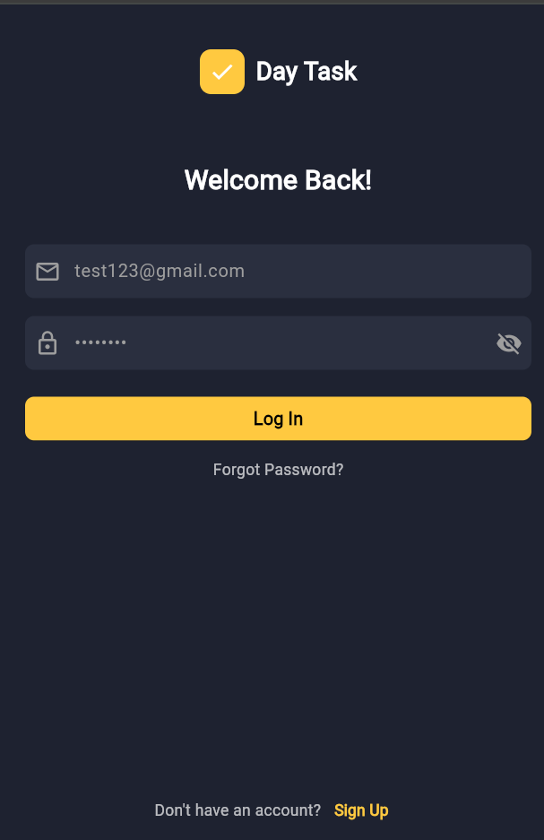
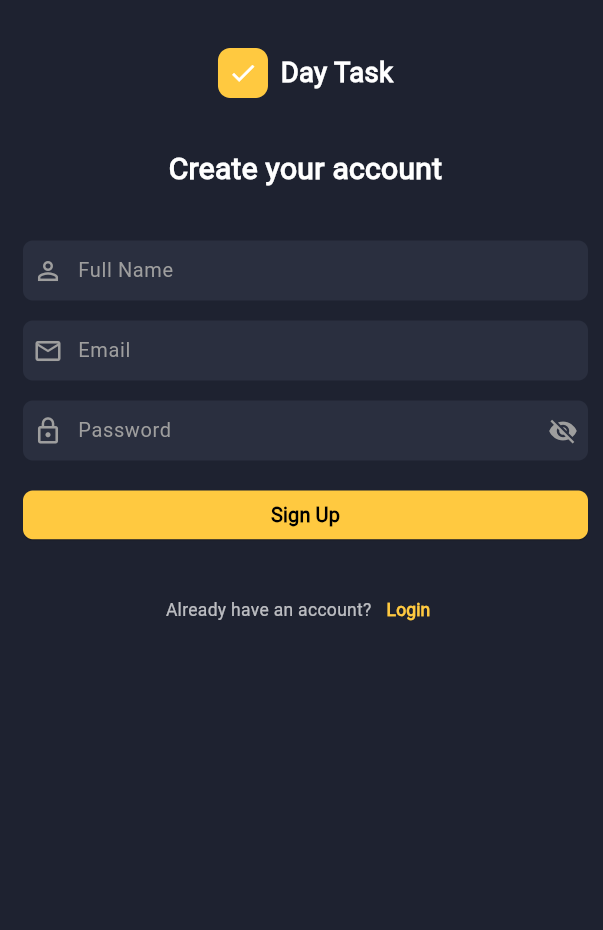
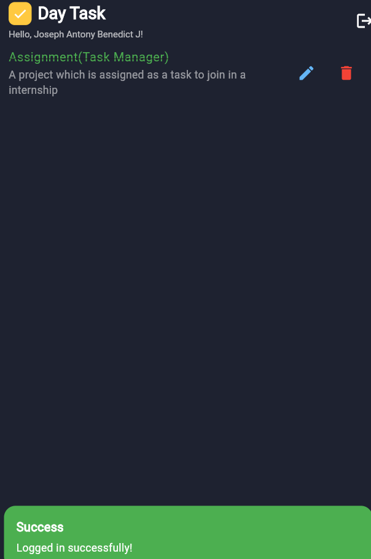

# ✅ DayTask - Task Management App

DayTask is a beautifully designed Flutter app that helps users manage their daily tasks with ease and efficiency. Built with Firebase Authentication and Firestore for real-time task syncing, it supports features like task creation, editing, marking complete, and due date reminders.

---

## 🚀 Features

- 🔐 Firebase Authentication (Sign Up / Login)
- 📆 Task creation with title, description, due date, and completion toggle
- 📝 Edit and delete existing tasks
- ☁️ Real-time data sync with Firebase Firestore
- 🌙 Dark-themed UI for comfortable use
- 👤 User-specific task lists
- 🔄 Persistent login and logout functionality

---

## 📸 Screenshots

